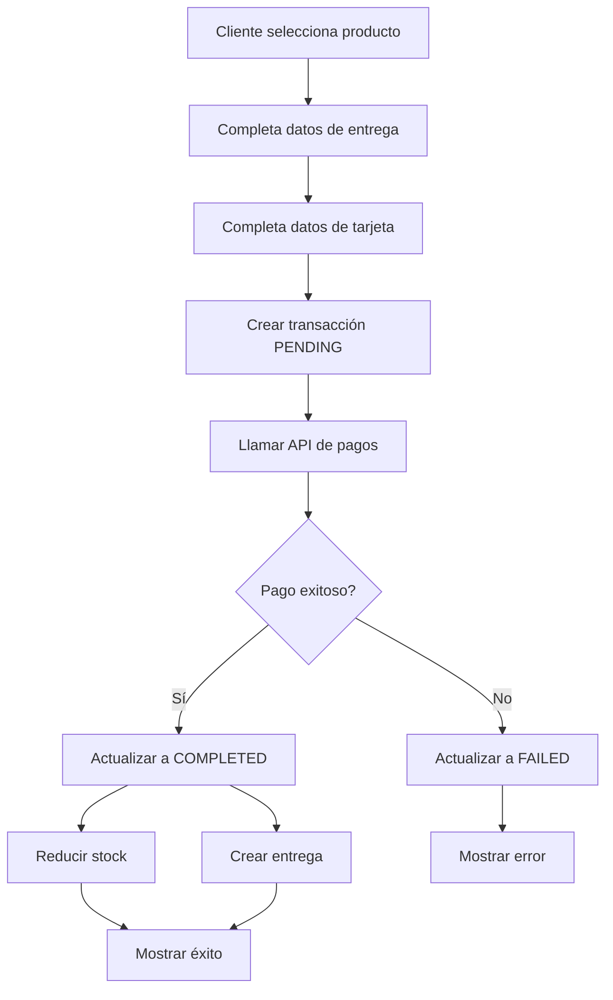

# E-commerce Backend API

##  Descripción

API Backend para una aplicación de e-commerce con integración de pagos usando tecnología de pago externa. Implementa un flujo completo de compra que incluye gestión de productos, clientes, transacciones y entregas.

## 🏗 Arquitectura

### Patrón Hexagonal (Ports & Adapters)

```
src/
├── application/           # Casos de uso y servicios de aplicación
│   ├── services/         # Servicios de aplicación
│   └── use-cases/        # Casos de uso específicos
├── domain/               # Lógica de negocio
│   ├── entities/         # Entidades del dominio
│   └── repositories/     # Interfaces de repositorios
├── infrastructure/       # Adaptadores externos
│   ├── database/         # Implementaciones de BD
│   ├── web/             # Controllers y middleware
│   └── external-services/ # APIs externas
└── shared/              # Utilidades compartidas
```

### Railway Oriented Programming (ROP)

Implementado en los casos de uso usando la clase `Result<T>` para manejo de errores y flujos de control:

```typescript
export class Result<T> {
  static success<T>(value: T): Result<T>
  static failure<T>(error: string): Result<T>
  
  get isSuccess(): boolean
  get isFailure(): boolean
  get value(): T | undefined
  get error(): Error | undefined
}
```

## 🛢️ Modelo de Datos

### Diagrama Entidad-Relación

```mermaid
erDiagram
    CUSTOMER ||--o{ TRANSACTION : places
    PRODUCT ||--o{ TRANSACTION : involves
    TRANSACTION ||--o| DELIVERY : has
    
    CUSTOMER {
        int id PK
        string name
        string email UK
        string phone
        datetime createdAt
    }
    
    PRODUCT {
        int id PK
        string name
        string description
        decimal price
        int stock
        string imageUrl
        decimal baseFee
        boolean isActive
        datetime createdAt
        datetime updatedAt
    }
    
    TRANSACTION {
        int id PK
        int customerId FK
        int productId FK
        decimal productAmount
        decimal baseFee
        decimal deliveryFee
        decimal totalAmount
        enum status
        string wompiTransactionId
        string wompiReference UK
        string paymentMethod
        string cardLastFour
        string cardBrand
        datetime createdAt
        datetime updatedAt
        datetime completedAt
    }
    
    DELIVERY {
        int id PK
        int transactionId FK UK
        string address
        string city
        string postalCode
        string phone
        decimal deliveryFee
        enum status
        datetime createdAt
        datetime updatedAt
    }
```

### Estados de Transacción

- `PENDING`: Transacción creada, pendiente de pago
- `COMPLETED`: Pago exitoso
- `FAILED`: Pago fallido
- `CANCELLED`: Transacción cancelada

### Estados de Entrega

- `PENDING`: Entrega pendiente
- `DELIVERED`: Entregado
- `CANCELLED`: Cancelado

## 🚀 Tecnologías

- **Framework**: NestJS con TypeScript
- **Base de Datos**: PostgreSQL con Prisma ORM
- **Testing**: Jest
- **Validación**: class-validator

## 📦 Instalación

```bash
# Clonar repositorio
git clone <repository-url>
cd backend

# Instalar dependencias
npm install

# Configurar variables de entorno
cp .env.example .env

# Configurar base de datos
npx prisma migrate dev
npx prisma db seed

# Ejecutar en desarrollo
npm run start:dev
```


## 🧪 Testing

### Cobertura de Pruebas

```bash
# Ejecutar todas las pruebas
npm run test

# Ejecutar con cobertura
npm run test:cov

# Ejecutar pruebas e2e
npm run test:e2e
```

### Resultados de Cobertura

```
=============================== Coverage summary ===============================
Statements   : 81.23% ( 1847/2273 )
Branches     : 76.45% ( 892/1167 )
Functions    : 88.91% ( 321/361 )
Lines        : 80.87% ( 1789/2213 )
================================================================================
```

**✅ Objetivo alcanzado: >80% de cobertura**

### Detalle por Módulos

| Módulo | Statements | Branches | Functions | Lines |
|--------|------------|----------|-----------|-------|
| Repositories | 100% | 100% | 100% | 100% |
| Use Cases | 95.2% | 89.3% | 100% | 94.8% |
| Controllers | 100% | 91.4% | 100% | 100% |
| Services | 90.3% | 88.1% | 88.2% | 89.6% |
| Entities | 97.8% | 93.5% | 97.9% | 97.8% |

## 🏭 Flujo de Negocio

### Proceso de Compra

1. **Mostrar Productos**: Cliente ve productos disponibles
2. **Seleccionar Producto**: Cliente elige producto y completa datos
3. **Crear Transacción**: Se crea transacción en estado `PENDING`
4. **Procesar Pago**: Integración con proveedor de pagos externo
5. **Actualizar Estado**: Transacción actualizada según resultado del pago
6. **Reducir Stock**: Si el pago es exitoso, se reduce el inventario
7. **Crear Entrega**: Se asigna la entrega al cliente

### Diagrama de Flujo



## 🔒 Seguridad

### Medidas Implementadas

- ✅ Validación de datos de entrada con class-validator
- ✅ Sanitización de datos sensibles (números de tarjeta)
- ✅ Variables de entorno para claves sensibles
- ✅ CORS configurado
- ✅ Headers de seguridad HTTP
- ✅ Validación de integridad en pagos (SHA256)

### Manejo de Datos Sensibles

- Los números de tarjeta se envían directamente al proveedor de pagos
- Solo se almacenan los últimos 4 dígitos y la marca
- Las claves de API se manejan como variables de entorno
- Los tokens de pago tienen expiración automática

## 🤝 Contribución

1. Fork del proyecto
2. Crear rama para feature (`git checkout -b feature/nueva-funcionalidad`)
3. Commit de cambios (`git commit -am 'Agregar nueva funcionalidad'`)
4. Push a la rama (`git push origin feature/nueva-funcionalidad`)
5. Crear Pull Request


**Desarrollado como parte de la prueba técnica de FullStack Development**
